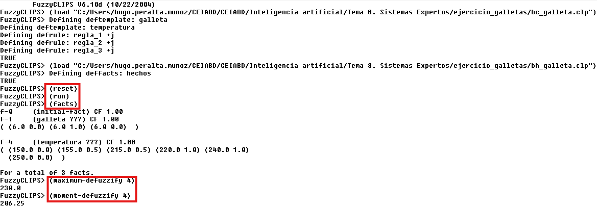

# Ejercicio de lógica difusa
Ejercicio de **Lógica Difusa** en el programa *CLIPS*.

Realizado por:
- Hugo Peralta Muñoz.
- José Antonio García Antona.

En este repositorio encontraremos dos archivos distintos, `bc_galleta.clp` y `bh_galleta.clp` lo cuáles son la base de conocimiento y la base de hechos de nuestro problema respectivamente.

## Caso de Uso
Tendremos dos plantillas distintas en este ejercicio, una para el estado de horneado de la galleta y otro para la temperatura:

- Galleta:
  - Un poco crudas.
  - Medio hechas.
  - Doraditas.
- Temperatura:
  - Baja.
  - Media.
  - Alta.

Tendremos también un conjunto de reglas, que dependiendo del valor de horneado de la galleta entrará en una temperatura de horneado u otra:
- Si las galletas están un poco crudas, entonces la temperatura del horno debe ser media.
- Si las galletas están medio hechas, entonces la temperatura del horno debe ser alta.
- Si las galletas están doraditas, entonces la temperatura del horno debe ser baja.

Lo que haremos a continuación será cargar los dos archivos en orden, primero el `bc_galletas.clp` y después el `bh_galletas.clp`, dentro de la aplicación *CLIPS*.

Tras esto seguiremos los siguientes comandos para ejecutar los cambios:

```bash
(reset)
(run)
```

Antes de ir al último paso, veremos los hechos para ver el número del hecho que representa el resultado:
```bash
(facts)
```

Por último, desborrosificaremos los resultados de nusetro problema con las siguientes dos funciones:
*En nuestro caso, el fact será el número 4*
```bash
(maximum-desfuzzify 4)
```

Y el segundo:
```bash
(moment-desfuzzify 4)
```

Y podremos ver el resultado final de la ejecución de todo el proyecto:


